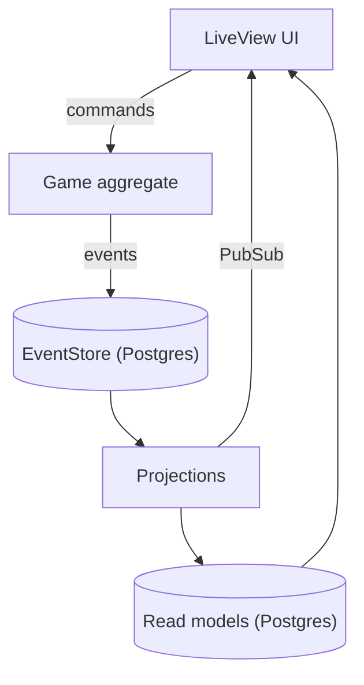

<h1 align="center">🚧 UNDER DEVELOPMENT 🚧</h1>

<p align="center"><strong>This project is a work in progress and is not yet playable.<br>Features described below are planned, and anything may change.</strong></p>

---

# Forkmate

An online chess game where every game is an append-only event stream, and any game can be **forked**: rewind to an earlier position, play a different move, and see every branch of the game in one overview.

> Status: the chess rules engine, the `Game` aggregate with branching, projections and a LiveView game UI are in place, along with the Storybook design system. Matchmaking, players, clocks-based timeouts and the other items under "Later" are not built yet. See [`docs/design-brainstorm.md`](docs/design-brainstorm.md) for the roadmap.

## The game

**MVP**

- Two players play a full, rules-correct game: all legal moves, castling, en passant and promotion.
- A game ends by checkmate, stalemate, resignation, agreed draw, threefold repetition, the fifty-move rule or timeout.
- Play against a Stockfish bot: pick the difficulty (Easy, Medium, Hard, Max) and your colour on the home page.
- Live board for both players, game history and replay.
- Rewind to any earlier position and play a different move to start a branch. Every branch is drawn in a git-style graph.

**Branching**

A game is a tree of positions, not a line. Rewinding is client-side and writes nothing. Playing a move from an earlier position appends an event, and if that position already has a continuation it becomes a new branch. Only the player whose colour is to move at a position may branch from it.


*Birdview in Phoenix Storybook (`/storybook`): every node is a small board, and the highlighted ring marks the current position.*

**Later:** matchmaking and lobbies, Elo ratings, tournaments, engine analysis, anti-cheat signals, variants such as Chess960.

## Architecture

Forkmate is CQRS / event sourcing. The design is described in [`docs/design-brainstorm.md`](docs/design-brainstorm.md); the `Game` aggregate, projections and UI below are implemented, while `Player`, `Challenge`/`Lobby` and `Tournament` are still planned.



- **Write side:** one `Game` aggregate per game, with the game ID as the stream ID. All rule checks happen in the aggregate, which calls a pure Elixir rules module with no Commanded dependency.
- **Game tree:** `MakeMove` carries `from_node_id`. If that node already has a child, a branch is created and `BranchCreated` is also emitted. `MoveMade` carries the SAN, the resulting FEN and clock timestamps, so read models and replay never re-run the rules.
- **Read side:** Ecto projections (for example a `nodes` table) built from events with `commanded_ecto_projections`. They can be reset and replayed from the store. The branch overview is drawn as SVG in LiveView.
- **Real time:** projections broadcast over Phoenix PubSub, so both players and spectators see moves as they happen.
- **Separate aggregates:** `Player`, `Challenge`/`Lobby` and `Tournament` stay apart from `Game` so a game's stream stays small.
- **Two databases:** `Forkmate.Repo` holds read models, and `Forkmate.EventStore` is a separate database for the event log.
- **UI:** presentational chess components live in `ForkmateWeb.GameComponents` and are developed in Phoenix Storybook at `/storybook`.

## Tech

- **Elixir / Phoenix 1.8** with **LiveView** for the real-time board and branch overview
- **Commanded** (CQRS/ES) with **EventStore** on Postgres for the event log
- **commanded_ecto_projections** and **Ecto** for read models
- **Postgres**, with two databases: one for read models and one for the event store
- **Tailwind CSS v4** and **esbuild** for assets, **Bandit** as the web server
- **Stockfish** (GPL-3.0) as the computer opponent, driven over UCI
- **Credo** (strict) for linting

## Getting started

Requires Elixir 1.15+ and Docker (for Postgres; see `docker-compose.yml`). Versions are pinned via `mise.toml`.

```sh
bin/dev            # starts Postgres, runs mix setup, then iex -S mix phx.server
```

Or step by step, with your own running Postgres:

```sh
mix setup          # deps, databases, migrations, seeds, assets
mix phx.server     # or: iex -S mix phx.server
```

`mise install` also installs Stockfish (needed for the computer opponent). Without mise, install it yourself and put it on `PATH` or set `STOCKFISH_PATH`.

Then visit [localhost:4000](http://localhost:4000) to start a game, or [localhost:4000/storybook](http://localhost:4000/storybook) for the component library.

In production, the event store reads `EVENTSTORE_DATABASE_URL` (falling back to `DATABASE_URL`) and `EVENTSTORE_POOL_SIZE`.

## Development

```sh
mix test                       # runs against a test database (needs Postgres up)
mix test path/to/file_test.exs # a single file
mix precommit                  # compile (warnings as errors), deps.unlock --unused, format, credo --strict, test
```

Run `mix precommit` before committing.
