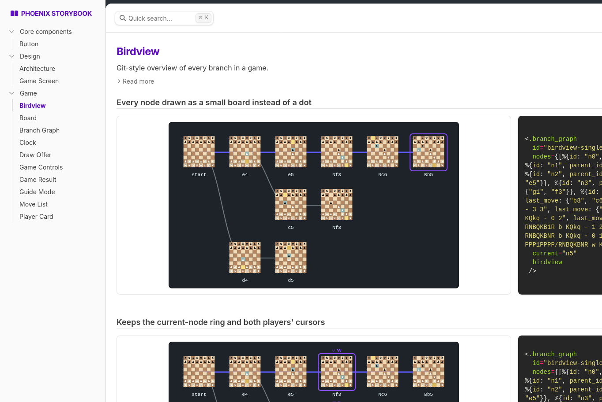

<h1 align="center">🚧 ALPHA 🚧</h1>

<p align="center"><strong>Forkmate is in alpha: playable, but rough and still changing.<br>Contributions are welcome!</strong></p>

---

# Forkmate

An online chess game where every game is an append-only event stream, and any game can be **forked**: rewind to an earlier position, play a different move, and see every branch of the game in one overview.

## The game

- Two players play a full, rules-correct game: all legal moves, castling, en passant and promotion.
- Play against the computer (Stockfish): pick the difficulty (Easy, Medium, Hard, Max) and your colour on the home page.
- A game ends by checkmate, stalemate, resignation, agreed draw, threefold repetition, the fifty-move rule or timeout.
- Rewind to any earlier position and play a different move to start a branch. Every branch is drawn in a git-style graph.

A game is a tree of positions, not a line. Rewinding is client-side and writes nothing; playing a move from an earlier position appends an event, and if that position already has a continuation it becomes a new branch. Only the player whose colour is to move at a position may branch from it.



**Later:** matchmaking and lobbies, Elo ratings, tournaments, engine analysis, variants such as Chess960. See [`docs/design-brainstorm.md`](docs/design-brainstorm.md) for the roadmap.

## Architecture

CQRS / event sourcing on Phoenix: LiveView sends commands to a `Game` aggregate (one per game), events go to an EventStore, and projections build Ecto read models and broadcast updates over PubSub.

- **Rules:** the aggregate calls the `Forkmate.Chess.Engine` behaviour, implemented by a Rust NIF over [`shakmaty`](https://github.com/niklasf/shakmaty) (`native/forkmate_chess`).
- **Game tree:** `MakeMove` carries `from_node_id`; a node that already has a child creates a branch. `MoveMade` carries SAN, the resulting FEN and clock timestamps, so read models and replay never re-run the rules.
- **Computer opponent:** a bot is just a player id (`bot:stockfish:<level>`). The `Forkmate.Bots.Player` event handler plays for bot seats with ordinary `MakeMove` commands, using a small pool of Stockfish processes over UCI.
- **Two databases:** `Forkmate.Repo` for read models, `Forkmate.EventStore` for the event log.
- **UI:** chess components live in `ForkmateWeb.GameComponents` and are developed in Phoenix Storybook at `/storybook`.

## Getting started

Requires Elixir, Rust 1.97+ and Docker (for Postgres). Versions are pinned in `mise.toml`, so `mise install` sets up the toolchain, including Stockfish.

```sh
bin/dev            # starts Postgres, runs mix setup, then iex -S mix phx.server
```

Or, with your own Postgres: `mix setup`, then `mix phx.server`. Visit [localhost:4000](http://localhost:4000) to start a game, or [localhost:4000/storybook](http://localhost:4000/storybook) for the component library.

The computer opponent needs Stockfish on `PATH` (or `STOCKFISH_PATH`); without it, "Play vs computer" reports the opponent as unavailable and everything else still works. In production, the event store reads `EVENTSTORE_DATABASE_URL` (falling back to `DATABASE_URL`) and `EVENTSTORE_POOL_SIZE`.

## Development

```sh
mix test                       # needs Postgres up; Stockfish tests are skipped without it
mix test path/to/file_test.exs # a single file
mix precommit                  # compile, format, credo --strict, cargo clippy/test, mix test
```

Run `mix precommit` before committing.

## Acknowledgements

Built on [Stockfish](https://stockfishchess.org) (GPL-3.0, runs as a separate process and is not bundled), [shakmaty](https://github.com/niklasf/shakmaty) (GPL-3.0-or-later) with [Rustler](https://github.com/rusterlium/rustler), [Phoenix](https://www.phoenixframework.org), [Commanded](https://github.com/commanded/commanded) with [EventStore](https://github.com/commanded/eventstore), [Ecto](https://github.com/elixir-ecto/ecto), [Phoenix Storybook](https://github.com/phenixdigital/phoenix_storybook) and [mise](https://mise.jdx.dev).

Because it links `shakmaty`, Forkmate is licensed under the GNU GPL v3 (see [`LICENSE`](LICENSE)).
